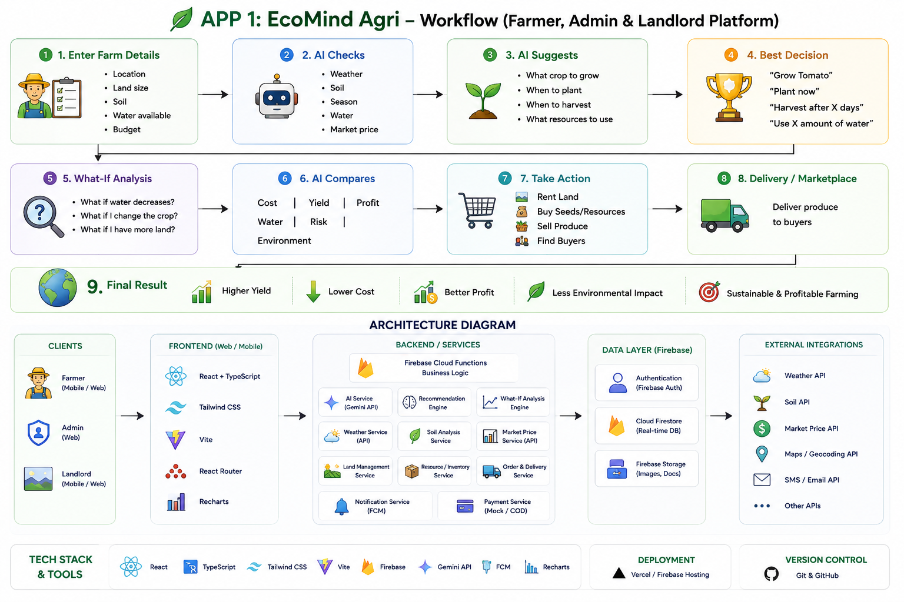

# 🌱 EcoMind

## AI-Powered Sustainability Decision & Agricultural Marketplace Platform

> **From sustainable farming to intelligent delivery — EcoMind connects every decision in the agricultural supply chain.**

EcoMind is an **AI-powered sustainability and agricultural ecosystem** that helps farmers make smarter farming decisions, enables efficient land and resource utilization, optimizes logistics, and connects fresh produce directly with customers.

The platform transforms fragmented agricultural, environmental, market, and logistics information into **actionable AI-powered decisions**.

Instead of simply answering *"What is happening?"*, EcoMind answers:

> **"What should I do next, and what will be the impact of that decision?"**

---

# 🎯 Problem Statement

Organizations and agricultural communities generate large amounts of information through:

* Farming activities
* Land utilization
* Soil and weather conditions
* Water availability
* Crop production
* Market prices
* Transportation
* Fuel consumption
* Delivery operations
* Resource usage

However, these data points are often **disconnected**.

A farmer may know the condition of their land but may not know:

* Which crop is most suitable?
* When should it be planted?
* How much water should be used?
* When should it be harvested?
* What will happen if the crop is changed?
* How will transportation affect the final cost?
* Where can the produce be sold?

Similarly, logistics operators may know delivery requirements but may not know:

* Which vehicle should be assigned?
* Which route is more efficient?
* Can multiple deliveries be consolidated?
* How can fuel consumption be reduced?
* How can transportation emissions be minimized?

### EcoMind brings these decisions together.

```text
                    RAW DATA
                       │
        ┌──────────────┼──────────────┐
        ↓              ↓              ↓
     FARMING          LAND         LOGISTICS
        │              │              │
        └──────────────┼──────────────┘
                       ↓
                  AI ANALYSIS
                       ↓
              PREDICTION & OPTIMIZATION
                       ↓
              WHAT-IF SCENARIO ANALYSIS
                       ↓
              ACTIONABLE RECOMMENDATION
                       ↓
              REAL-WORLD EXECUTION
                       ↓
              MEASURABLE IMPACT
```

---

# 💡 Our Solution

EcoMind is designed as **two interconnected applications** powered by a common backend and intelligence layer.

### 🌾 APP 1 — EcoMind Agri

A smart farming and sustainability platform for:

* 👨‍🌾 Farmers
* 🛡️ Administrators
* 🏠 Landlords

### 🥬 APP 2 — EcoMind Fresh

A farm-to-customer marketplace and delivery platform for:

* 🛒 Customers
* 🚚 Delivery Partners

Both applications communicate with the same backend ecosystem.

```text
                 🌱 ECO MIND ECOSYSTEM
                         │
             ┌───────────┴───────────┐
             │                       │
             ▼                       ▼
     🌾 EcoMind Agri          🥬 EcoMind Fresh
     Farmer / Admin           Customer / Driver
     / Landlord
             │                       │
             └───────────┬───────────┘
                         ▼
                🤖 AI + BACKEND
                         │
             ┌───────────┼───────────┐
             ↓           ↓           ↓
          Farming     Logistics    Marketplace
             │           │           │
             └───────────┼───────────┘
                         ↓
                 🌍 SUSTAINABILITY
```

---

# 🌾 APP 1 — EcoMind Agri

### Farmer, Admin & Landlord Platform

EcoMind Agri helps transform traditional farming decisions into **data-driven and sustainability-aware decisions**.

---

## 🔄 Farmer Workflow

The complete farmer journey follows a simple decision-making pipeline.

```text
1. Enter Farm Details
          ↓
2. AI Checks
          ↓
3. AI Suggestions
          ↓
4. Best Decision
          ↓
5. What-If Analysis
          ↓
6. AI Comparison
          ↓
7. Take Action
          ↓
8. Delivery / Marketplace
          ↓
9. Final Result
```

---

## 1️⃣ Enter Farm Details

The farmer provides:

* 📍 Location
* 🌾 Land size
* 🪨 Soil information
* 💧 Water availability
* 💰 Budget
* 🌱 Farming requirements

This information becomes the foundation for personalized recommendations.

---

## 2️⃣ AI Checks

EcoMind analyzes multiple factors before generating recommendations.

### Environmental Factors

* Weather
* Soil
* Season
* Water availability

### Economic Factors

* Market price
* Expected production
* Budget
* Resource requirements

The system combines these factors instead of making decisions from a single data point.

---

## 3️⃣ AI Suggestions

The AI recommendation engine can suggest:

* 🌱 What crop to grow
* 📅 When to plant
* 🌾 When to harvest
* 💧 How much water to use
* 📦 What resources to use

Example:

> **Recommended Crop: Tomato**

> Based on soil conditions, water availability, season, expected yield, and market conditions.

---

# 🏆 4️⃣ Best Decision

EcoMind evaluates available alternatives and recommends the most suitable strategy.

The decision can consider:

```text
                 DECISION
                    │
       ┌────────────┼────────────┐
       ↓            ↓            ↓
      COST         YIELD        RISK
       │            │            │
       └────────────┼────────────┘
                    ↓
               WATER USAGE
                    ↓
             ENVIRONMENTAL
                 IMPACT
                    ↓
              AI DECISION
```

Instead of optimizing only for profit, EcoMind considers:

### **Profit + Risk + Resource Efficiency + Sustainability**

---

# 🔮 5️⃣ What-If Analysis

Farmers can explore hypothetical scenarios before making decisions.

### Example questions:

> **What if I reduce water usage?**

> **What if I change the crop?**

> **What if I have more land?**

> **What if the market price changes?**

> **What if transportation costs increase?**

The system predicts how these changes may affect the final outcome.

---

# ⚖️ 6️⃣ AI Comparison

EcoMind compares different strategies across multiple dimensions.

| Parameter               | Strategy A | Strategy B |
| ----------------------- | ---------: | ---------: |
| 💰 Cost                 |     Higher |      Lower |
| 🌾 Yield                |     Medium |     Higher |
| 💧 Water                |     Higher |      Lower |
| ⚠️ Risk                 |     Medium |        Low |
| 💵 Profit               |     Medium |     Higher |
| 🌍 Environmental Impact |     Higher |      Lower |

The farmer can therefore understand **why** a particular decision is recommended.

---

# 🛒 7️⃣ Take Action

Recommendations are connected directly to real-world actions.

Farmers can:

* 🏠 Rent land
* 🌱 Buy seeds
* 📦 Purchase resources
* 🥬 Sell produce
* 👥 Find buyers

This turns EcoMind from a recommendation system into an **action-oriented platform**.

---

# 🚚 8️⃣ Delivery / Marketplace

Once produce is ready, EcoMind connects the farmer to the marketplace and delivery ecosystem.

```text
Farmer
   ↓
Produce Available
   ↓
Marketplace
   ↓
Customer Order
   ↓
Delivery Assignment
   ↓
Pickup
   ↓
Delivery
```

This creates a direct connection between **production and consumption**.

---

# 🌍 9️⃣ Final Result

EcoMind aims to produce measurable outcomes:

```text
🌾 Higher Yield
      +
💰 Lower Cost
      +
📈 Better Profit
      +
💧 Efficient Resource Usage
      +
🌱 Lower Environmental Impact
      ↓
🎯 Sustainable & Profitable Farming
```

---

# 🥬 APP 2 — EcoMind Fresh

## Customer & Delivery Partner Platform

EcoMind Fresh connects customers with **fresh produce directly from farms and nearby hubs**.

The objective is to reduce unnecessary intermediaries and improve the efficiency of local agricultural distribution.

---

# 🔄 Customer-to-Delivery Workflow

```text
1. Select Delivery Location
          ↓
2. Browse Fresh Produce
          ↓
3. Add to Cart & Checkout
          ↓
4. Order Processing
          ↓
5. Delivery Partner Accepts
          ↓
6. Pickup from Farm / Hub
          ↓
7. Delivery
          ↓
8. Final Result
```

---

# 📍 1️⃣ Select Delivery Location

Customers provide their delivery location:

* State
* District
* Urban / Rural
* City / Town
* Village / Locality
* Pincode

EcoMind can then identify nearby farms or distribution hubs.

### Example

```text
Customer Location
       ↓
Nearby Farm / Hub
       ↓
6.5 km
       ↓
~20 minutes
```

This location-aware model supports **shorter supply chains**.

---

# 🥕 2️⃣ Browse Fresh Produce

Customers can:

* Search products
* Browse categories
* View prices
* Check availability
* Purchase directly from the agricultural ecosystem

Example:

```text
Fresh Tomato
₹35 / kg
120 kg available

[ Add to Cart ]
```

---

# 🛒 3️⃣ Add to Cart & Checkout

Customers can:

* Select quantity
* Add delivery address
* Select payment method
* Review cart
* Place order

The order system automatically communicates with inventory and delivery services.

---

# ⚙️ 4️⃣ Order Processing

Once an order is placed, EcoMind:

1. Checks stock
2. Confirms the order
3. Finds the nearest farm/hub
4. Assigns a delivery partner
5. Generates an order ID
6. Sends notifications

---

# 🚚 5️⃣ Delivery Partner Accepts Order

The delivery partner receives:

* Order information
* Pickup location
* Customer destination
* Delivery details
* Recommended route

The driver can accept the delivery directly from the application.

---

# 🏡 6️⃣ Pickup From Farm / Hub

The delivery partner:

```text
Reach Farm / Hub
       ↓
Verify Order
       ↓
Pickup Produce
       ↓
Start Delivery
```

This connects the agricultural production layer directly with logistics.

---

# 🗺️ 7️⃣ Out for Delivery

The system can provide:

* Route
* Distance
* Estimated travel time
* Pickup location
* Customer location

Location and mapping services can be used to support route and distance calculations.

---

# 🏠 8️⃣ Delivered

The customer receives the fresh produce.

The order lifecycle becomes:

```text
ORDERED
   ↓
CONFIRMED
   ↓
ASSIGNED
   ↓
PICKED UP
   ↓
OUT FOR DELIVERY
   ↓
DELIVERED
```

---

# ⭐ 9️⃣ Final Result

EcoMind Fresh aims to create:

* 🌱 Fresher produce
* 💰 Better prices for customers
* 👨‍🌾 Better income opportunities for farmers
* 🚚 Faster delivery
* 🏘️ Stronger local economy
* 👥 Reduced unnecessary intermediaries
* 🌍 More efficient transportation

---

# 🤖 AI Intelligence Layer

The AI layer is the core of EcoMind.

```text
                    AI ENGINE
                       │
       ┌───────────────┼────────────────┐
       ↓               ↓                ↓
  AI Service     Recommendation     What-If
  (GenAI)          Engine           Engine
       │               │                │
       └───────────────┼────────────────┘
                       ↓
              Predictive Analytics
                       ↓
                  Optimization
                       ↓
             Sustainability Impact
                       ↓
              Actionable Decision
```

---

# 🧠 AI Capabilities

## Machine Learning

Used for:

* Crop recommendations
* Yield prediction
* Resource prediction
* Demand prediction
* Risk estimation

## Generative AI

Used for:

* Natural-language interaction
* Sustainability explanations
* Personalized recommendations
* Decision assistance
* Scenario explanations

## NLP

Allows users to ask questions naturally:

> "Which crop should I grow this season?"

> "How can I reduce water usage?"

> "Which delivery is closest?"

> "What happens if I change my crop?"

---

# 🔮 Predictive Analytics

EcoMind can predict potential outcomes before actions are taken.

```text
Historical Data
      ↓
ML Model
      ↓
Prediction
      ↓
Potential Outcome
      ↓
Decision
```

Possible predictions include:

* Crop yield
* Resource demand
* Market trends
* Delivery time
* Fuel consumption
* Sustainability impact

---

# ⚡ Optimization Engine

EcoMind uses optimization to identify better strategies.

### Farming Optimization

Optimize:

* Crop selection
* Water usage
* Resource allocation
* Planting schedule

### Logistics Optimization

Optimize:

* Vehicle assignment
* Delivery sequence
* Route selection
* Distance
* Delivery time
* Vehicle utilization

### Marketplace Optimization

Optimize:

* Farm-to-customer matching
* Nearest fulfillment location
* Inventory availability
* Delivery assignment

---

# 🌍 Sustainability Engine

EcoMind evaluates environmental impact throughout the ecosystem.

### Possible sustainability indicators

```text
💧 Water Consumption
⛽ Fuel Consumption
🌍 CO₂ Emissions
⚡ Energy Consumption
🌱 Resource Efficiency
🚚 Transportation Efficiency
🌾 Land Utilization
♻️ Waste Reduction
```

The objective is to make sustainability measurable and actionable.

---

# 🔗 Connected Ecosystem

One of the major strengths of EcoMind is the relationship between different entities.

```text
              👨‍🌾 FARMER
                  │
             grows crop
                  ↓
              🌾 PRODUCE
                  │
             listed for sale
                  ↓
             🥬 MARKETPLACE
                  │
             customer order
                  ↓
              📦 ORDER
                  │
          delivery assignment
                  ↓
             🚚 DRIVER
                  │
              pickup
                  ↓
             🏠 CUSTOMER
```

Behind this workflow:

```text
Farmer
  ↕
Land
  ↕
Resources
  ↕
Production
  ↕
Inventory
  ↕
Marketplace
  ↕
Logistics
  ↕
Transportation
  ↕
Customer
```

This enables EcoMind to understand the **complete lifecycle of an agricultural decision**.

---

# 🏠 Landlord Module

Landlords form an important part of the EcoMind agricultural ecosystem.

They can manage and monitor:

* Land information
* Land availability
* Land utilization
* Agricultural activity
* Resource information
* Rental opportunities

This enables unused or underutilized agricultural land to become part of the productive ecosystem.

```text
Available Land
      ↓
Land Management
      ↓
Farmer Matching
      ↓
Agricultural Activity
      ↓
Production
      ↓
Marketplace
```

---

# 🛡️ Admin & Logistics Control Center

The administrative layer provides centralized visibility into the ecosystem.

### Admin can monitor:

* Farmers
* Landlords
* Customers
* Delivery partners
* Orders
* Inventory
* Land
* Farming activity
* Logistics
* Sustainability metrics

### Logistics operations include:

* Delivery assignment
* Vehicle availability
* Pickup coordination
* Delivery tracking
* Route information
* Order status

This allows the platform to coordinate the entire operational workflow.

---

# 🏗️ System Architecture


---

# 🔐 Role-Based Access

EcoMind provides dedicated experiences for every stakeholder.

| Role                    | Platform                 | Primary Responsibility              |
| ----------------------- | ------------------------ | ----------------------------------- |
| 👨‍🌾 **Farmer**        | EcoMind Agri             | Farming, resources, crop & produce  |
| 🛡️ **Admin**           | EcoMind Agri             | Platform monitoring & governance    |
| 🚚 **Logistics**        | Backend/Admin Operations | Orders, assignment & transportation |
| 🚛 **Delivery Partner** | EcoMind Fresh            | Pickup & delivery execution         |
| 🏠 **Landlord**         | EcoMind Agri             | Land management & utilization       |
| 🛒 **Customer**         | EcoMind Fresh            | Browse, purchase & receive produce  |

---

# 🛠️ Technology Stack

## Frontend

* ⚛️ React
* 📘 TypeScript
* 🎨 Tailwind CSS
* ⚡ Vite
* 🧭 React Router
* 📊 Recharts
* 🔄 Context / State Management

## Backend

* 🔥 Firebase Cloud Functions
* 🔥 Firebase Authentication
* 🔥 Cloud Firestore
* 🔥 Firebase Storage
* 🔔 Firebase Cloud Messaging

## AI & Intelligence

* 🤖 Generative AI
* 🧠 Machine Learning
* 💬 NLP
* 📈 Predictive Analytics
* ⚡ Optimization Algorithms
* 🔗 Knowledge Graphs

## External Services

* 🌦️ Weather API
* 🌱 Soil Data API
* 💰 Market Price API
* 🗺️ Maps / Geocoding API
* 📩 SMS / Email APIs

## Deployment

* ▲ Vercel
* 🔥 Firebase Hosting

## Version Control

* Git
* GitHub

---

# 🔄 End-to-End EcoMind Journey

The complete platform can be represented as:

```text
                  👨‍🌾 FARMER
                      │
                      ▼
             Enter Farm Details
                      │
                      ▼
                🤖 AI Analysis
                      │
                      ▼
             Crop Recommendation
                      │
                      ▼
               What-If Analysis
                      │
                      ▼
             Best Farming Decision
                      │
                      ▼
                🌾 PRODUCE
                      │
                      ▼
              🥬 MARKETPLACE
                      │
                      ▼
               🛒 CUSTOMER
                      │
                      ▼
                 📦 ORDER
                      │
                      ▼
              🚚 LOGISTICS
                      │
                      ▼
             🚛 DELIVERY PARTNER
                      │
                      ▼
                 🏠 CUSTOMER
                      │
                      ▼
             📊 IMPACT ANALYSIS
                      │
                      ▼
                 🌱 ECO MIND
```

---

# 💎 What Makes EcoMind Different?

## 1. 🌱 Sustainability Is Built Into Decisions

Sustainability is not treated as a final report.

It is considered during:

**Planning → Production → Logistics → Delivery**

---

## 2. 🤖 AI Doesn't Just Predict — It Recommends

Traditional analytics:

> "Water consumption is 10,000 litres."

EcoMind:

> "Your current strategy uses 10,000 litres. Based on the available alternatives, Strategy B may reduce estimated consumption while maintaining the projected yield."

---

## 3. 🔮 What-If Decision Making

Users can experiment with hypothetical decisions before implementing them.

```text
"What if?"
     ↓
Simulation
     ↓
Prediction
     ↓
Comparison
     ↓
Best Decision
```

---

## 4. 🔗 End-to-End Agricultural Ecosystem

EcoMind connects:

**Land → Farmer → Crop → Resources → Produce → Marketplace → Logistics → Customer**

This allows decisions to be evaluated across the entire ecosystem.

---

## 5. 🚚 Sustainability-Aware Logistics

Transportation is not treated as a separate process.

EcoMind considers:

* Distance
* Vehicle
* Route
* Delivery
* Fuel
* Time
* Environmental impact

---

## 6. 🥬 Farm-to-Customer Connectivity

EcoMind Fresh creates a digital bridge between farmers and customers.

```text
Farmer
  ↓
Fresh Produce
  ↓
Marketplace
  ↓
Customer
  ↓
Local Delivery
```

This can help create shorter and more efficient supply chains.

---

# 🏆 Hackathon Innovation

EcoMind transforms the original sustainability challenge into a **real-world decision ecosystem**.

Instead of building only:

> **"A dashboard showing sustainability metrics"**

we build:

> **"An intelligent platform that understands agricultural and operational data, predicts outcomes, compares alternatives, recommends actions, and connects those actions to real-world execution."**

### The intelligence loop

```text
                DATA
                 ↓
              ANALYZE
                 ↓
              PREDICT
                 ↓
             SIMULATE
                 ↓
             COMPARE
                 ↓
            RECOMMEND
                 ↓
               ACT
                 ↓
              MEASURE
                 ↓
             OPTIMIZE
                 │
                 └──────────► DATA
```

---

# 🌍 Impact

EcoMind aims to create impact at multiple levels.

### 👨‍🌾 Farmer

* Better crop decisions
* Improved resource utilization
* Better market access
* Increased profitability

### 🏠 Landlord

* Better land utilization
* Improved land visibility
* Additional opportunities for land usage

### 🚚 Logistics

* Better delivery planning
* Reduced unnecessary trips
* Improved vehicle utilization
* Lower transportation impact

### 🛒 Customer

* Fresher produce
* Transparent pricing
* Local sourcing
* Faster delivery

### 🌍 Environment

* Reduced resource wastage
* Lower transportation impact
* Better resource efficiency
* Sustainability-aware decisions

---

# 🚀 Future Scope

EcoMind can be extended with:

* 📡 IoT-based farm sensors
* 🛰️ Satellite imagery
* 🌦️ Real-time weather intelligence
* 📍 Live GPS tracking
* 🚛 Real-time fleet optimization
* 🌱 Computer vision for crop health
* 📊 Advanced carbon accounting
* ♻️ Waste management optimization
* 💳 Real payment gateway integration
* 🧾 Digital sustainability certificates
* 🌍 Carbon-credit integration
* 📈 Advanced demand forecasting
* 🤖 Autonomous decision recommendations

---

# 🎯 Our Vision

> ### **"Make every agricultural and operational decision sustainability-aware."**

EcoMind envisions an ecosystem where AI does not simply provide information.

It helps people **understand, compare, decide, act, and measure the impact of their decisions.**

```text
       🌾 FARM
          ↓
       🤖 AI
          ↓
      🧠 DECISION
          ↓
       🚚 ACTION
          ↓
       📊 IMPACT
          ↓
       🌱 SUSTAINABILITY
```

---

# 🏅 EcoMind

### **Measure. Predict. Compare. Optimize. Act.**

**AI-powered decisions for a smarter, more sustainable agricultural ecosystem.**

---

### Built for the SIMATS, Chennai Hackathon

**EcoMind — From Farm Decisions to Sustainable Delivery**
